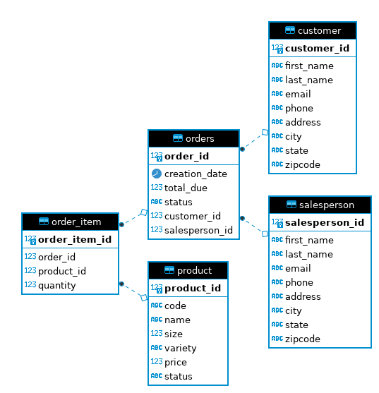

# Introduction
The JDBC application allows for data retrieval from a retail database pertaining to customers and their orders.
The app allows for CRUD (Create Read Update Delete) operations to be implemented.
The RDBMS being used to manage the system is PostgreSQL and this was done via Docker. Java 8 is also the language and version used in this project, 
with Maven dependencies.

# Implementation
## ER Diagram

## Design Patterns

The Data Access Object Pattern (DAO), is an abstraction of data persistence and is considered closer to the 
underlying storage, which is often table-centric. Hence, DAOs match database tables and enables a more direct approach to send/retrieve data 
from storage, preventing complex queries.

Repository Design Pattern is a pattern that is an abstraction of a collection of objects.
Repository pattern focuses only on single table access per class. Instead of joining in the database,
in the repository pattern you join in the code. A repository can use a DAO to fetch data from the database and populate a domain object. 
Or, it can prepare the data from a domain object and send it to a storage system using a DAO for persistence.

The CustomerDAO class is best defined as following the Repository pattern, since it only interacts with 
the customer table; while, the OrderDAO follows the DAO pattern. The Repository pattern focuses on a single table per class.
The Repository Design pattern is implemented by joining a collection of tables to obtain the resultSet instead of designing and joining multiple DAOs.

# Test
The database structure and query were tested by running the queries provided in the Lynda course and confirming the
results were the same. The results retrieved from the database using JDBC was tested by checking if the format
was similar to the results on DBeaver database tool.

