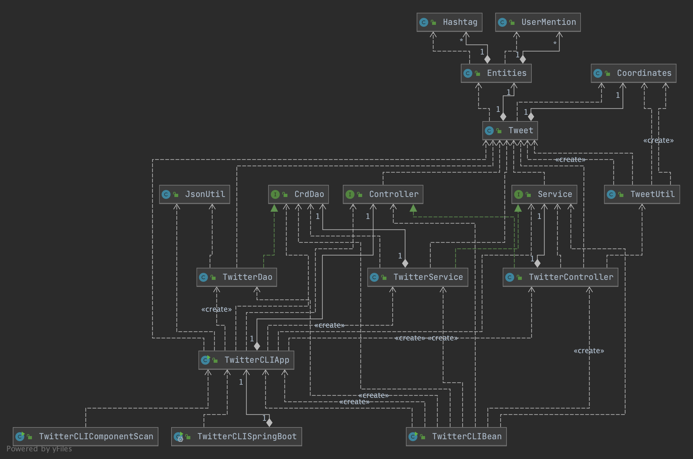

# Introduction
The Twitter CLI Application is an MVC project that allows users to post, show or delete tweets on twitter 
via Twitter REST API. The MVC architecture is used to implement the sending of requests to the Twitter REST 
API and responses are retrieved via the HttpClient. Tweets  are retrieved in JSON format and are then converted
into Tweet Objects. The project was packaged by Maven dependencies and was deployed to Docker, while 
exploring the different Spring Frameworks. Testing was done using Junit, Integration and Mockito testing.

# Quick Start
To package the app using Maven:

```bash
mvn clean package spring-boot:repackage -DskipTests
```

To run the app on Docker:

```bash
docker run -rm /
-e consumerKey="consumerKey goes here" /
-e consumerSecret="consumerSecret goes here" /
-e accessToken="accessToken goes here" /
-e tokenSecret="tokenSecret goes here" /
ekeneanonyai/twitter "post|show|delete" [options]"
```

# Design
## UML diagram

## Components of the Application (app/main, controller, service, DAO)
The application has four main components:
- **TwitterCLIApp**: The app/ main class is used to initialize the other components and dependencies based on which command is passed in as an argument.
- **TwitterController**: The controller layer parses user input from the command line, ensuring it is formatted correctly before passing it on to the service layer
- **TwitterService**: The service layer checks that the request being sent to the DAO maintains the correct format according to Twitter API standards, such as the length of the tweet and the longitude and latitude.
- **TwitterDAO**: The Data Access Layer, handles the REST API data exchange with the external connection. The DAO calls the HttpHelper to send HTTP requests and get HTTP responses with a given URI.

## Models
The Tweet model is the DTO used throughout the entire App. It contains returns data from the Twitter API
response that consists of the other models in the app and other information, such as: idStr, id, 
created_at, text in the tweet, Coordinates, Entity, RetweetCount, favoriteCount, retweeted and favorited. 

## Spring
Due to the dependency relationships between classes, Spring was used to manage the dependencies as the current implementation could cause a lot of problems and 
be very tedious for larger projects. Spring is used to replace the main method of the Twitter application. 

There were three different approaches used; `TwitterCLIBean`, `TwitterCLIComponentScan` and `TwitterCLISpringBoot`.
- `TwitterCLIBean` uses manually set `@Bean` annotations to indicate dependencies for the application context to fulfil.
- `TwitterCLIComponentScan` automatically scans the entire project for all dependencies in the application. The Component Scan method of dependency injection given by Spring allows for developers to mark classes that are
  components of the app that require dependencies, and Spring takes care of setting up dependencies using the constructors of each of the components.
- `TwitterCLISpringBoot` uses Spring Boot's extended Spring implementation so that the extensive boilerplate from Spring isn't needed.

# Test
To test the app we used JUnit amd Mockito. Firstly JUnit was used to implement integration tests for each component and 
confirm the app was running as expected based on the environment variables passed in. 

Mockito was used to conduct unit tests on the components to make sure the functions in them could work in failed and successful mock scenarios. 
Hence, this was used to ensure that the information was being retrieved, used or sent correctly.

## Deployment
Firstly, we used maven clean to get rid of any target packages already existing and then used maven
to package the application into a jar file. Next, we created a Dockerfile and built a 'twitter' image of the
Twitter app. After running the docker image, it was pushed to DockerHub.

# Improvements
- Allow for multiple tweets to be shown, like the 'delete' option.
- Allow users to not show their location if they do not want to. 
- Allow tweets to be retrieved using keywords and not just IDs.
