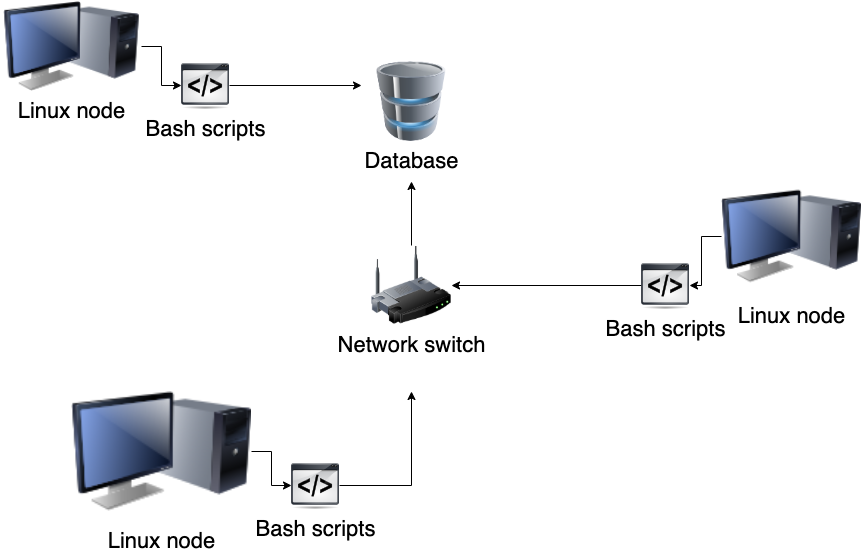

# Linux Cluster Monitoring Agent
## Introduction
The Linux Cluster Monitoring Agent (LCMA) is a tool designed to monitor and collect data from host machines over a network using IPv4 addresses; this includes hardware specifications, activity, and performance of Linux machines within a cluster. This data is stored in a PostgreSQL (psql) Relational Database Management System (RDBMS) and uses Docker containers. Docker is used to keep consistency between nodes/ servers. Bash scripts are used to initialize the process by creating the psql container using docker. The other scripts are used to monitor data within the Linux cluster related to the host information and usage by the host. The data, such as, CPU number, number of caches, amount of free memory, hostname, etc. is collected in real time and inserted into the database. The LCMA runs every minute using crontab, to generate statistics about resources and help users plan around resources with data. The Monitoring Agent uses crontab to collect data and send this data to the database on a scheduled basis.

## Quick Start
- Start a psql instance using psql_docker.sh
````bash
./scripts/psql_docker.sh create [db_username] [db_password]
````

- Create tables using ddl.sql
````bash
psql -h psql_host -U db_username -d host_agent -f sql/ddl.sql
````

- Insert hardware specs data into the db using host_info.sh
````
./scripts/host_info.sh [psql host] [port] host_agent [db_username] [db_password]
````

- Insert hardware usage data into the db using host_usage.sh
````
./scripts/host_usage.sh psql_host psql_port host_agent db_username db_password
```` 

- Crontab setup
````
# edit cronjobs
crontab -e 

# add to crontab
* * * * * bash <your path>/scripts/host_usage.sh localhost 5432 host_agent postgres password > /tmp/host_usage.log

# list crontab jobs
crontab -l

#- Use `crontab -l` to display command, and then test the command from the terminal as it (remove `* * * * *`).
````

## Implemenation
Firstly, the psql_docker.sh script was implemented, and this created a PostgreSQL container which was useful for the rest of the project. The database host_agent was then set up using PostegreSQL command line interface. Ddl.sql was implemented next to create the tables for the database aforementioned; these tables were host_info and host_usage. Queries.sql was created to retrieve information from the tables. After this, I implemented scripts for these tables to help insert into them; host_info.sh and host_usage.sh. Host_usage.sh was also used to set up crontab jobs. 

## Architecture 


### Scripts
To run these scripts or sql files, look under 'quick start' section.

-psql_docker.sh - is used to create a docker container or start/stop a container if one already exists

-host_info.sh - is used to get hardware configuration data of the host and then insert the data into the database.

-host_usage.sh - is used to collect usage of resources. This is run every minute using crontab.

-crontab - is used to get the script to run every minute, i.e. crontab jobs run certain scripts repeatedly within the given time.

-ddl.sql - is used to create the database tables needed for the host_agent database, that is, creation of the two tables host_info and host_usage.

-queries.sql - is used to get information on the cluster and manage the different data from usage for future enterprise planning. The queries.sql is used to resolve business issues by the information it collects:
i. It is used to find out which host has the most memory.
ii. It also helps find out the average memory used every 5 minutes.
iii. This also helps detect failure of the node if it inserts less than three data points within 5-min intervals.

### Database Modeling

The `host_agent` database contains two tables:
- `host_info` contains the hardware specifications of each node in the cluster.

Field | Description
--- | ---
`id` | Primary Key, Auto-incremented unique identifier for the host
`hostname` | The unique name of the host
`cpu_number` | The number of cores the CPU has
`cpu_architecture` | The architecture of the CPU
`cpu_model` | The name of the CPU model
`cpu_mhz` | The clock speed of the CPU, in MHz
`L2_cache` | The size of the L2 cache in kB
`total_mem` | The total memory in the node in kB
`timestamp` | The time when the hardware specifications were taken

- `host_usage` which contains the usage specifications of each node in the cluster.

Field | Description
--- | ---
`timestamp` | UTC time of when these stats were taken
`host_id` | The ID of the corresponding host_info entry
`memory_free` | The amount of free memory in the node in MB
`cpu_idle` | The percentage of time that the CPU is idle
`cpu_kernel` | The percentage of time the CPU is running kernel code
`disk_io` | The number of disks currently undergoing I/O processes
`disk_available` | Available space in the disk's root directory in MB

## Test
-	For the bash scripts, testing was done in terminal using command line to ensure everything was running properly. The scripts had conditions in them to verify that the correct number of arguments were being in put in. If the testing returned with exit 0 then the scripts were successfully run.
-	For the SQL queries, testing was done on the PSQL command line and ensured there were no errors and accurate results were being returned.
-	All of these were also run within the IntelliJ IDE which has tools to ensure that the scripts follow the right syntax, as well as, a database tool.

## Improvements
- Write additional queries to tackle more failures.
- Create backup system in case database fails. 
- Edit crontab to monitor more information from the servers.
