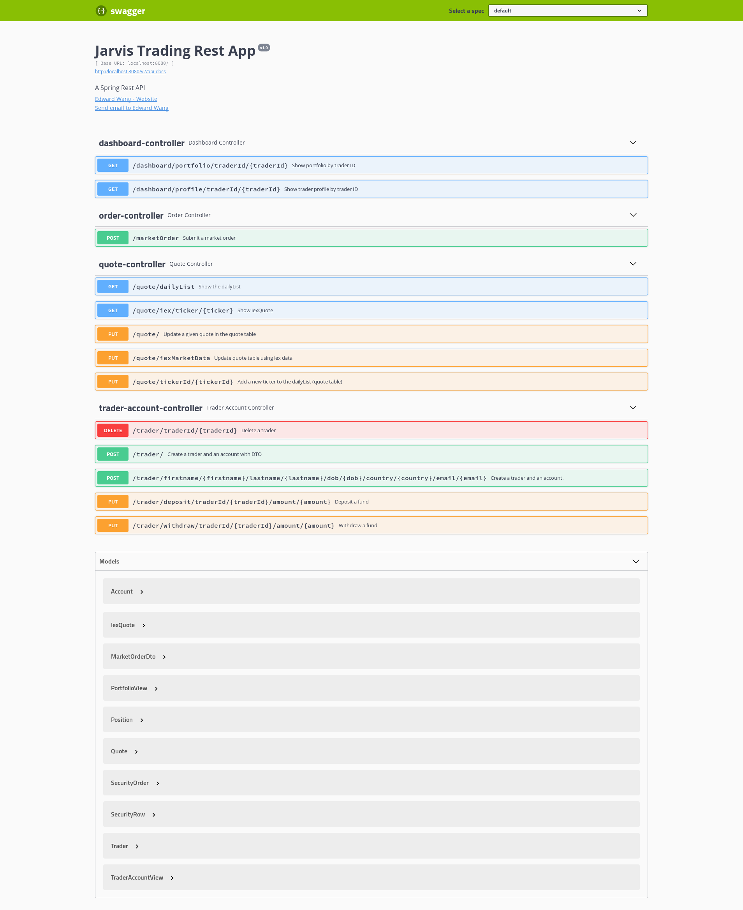
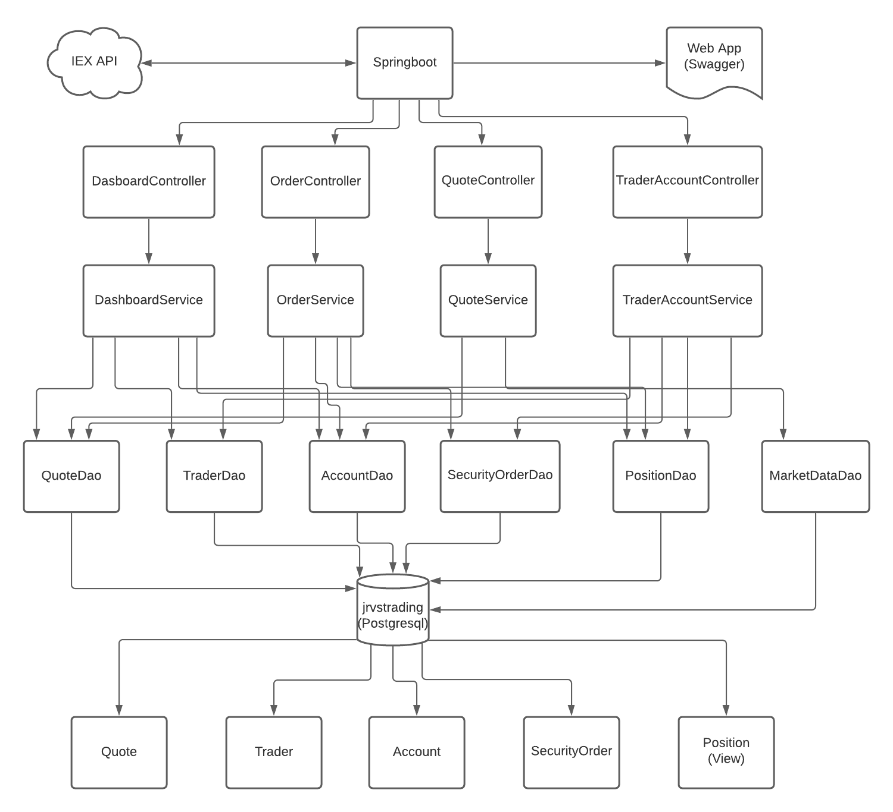
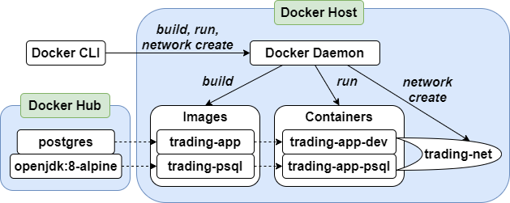

Table of contents
* [Introduction](#Introduction)
* [Quick Start](#QuickStart)
* [Implementation](#Implementation)
* [Test](#Test)
* [Deployment](#Deployment)
* [Improvements](#Improvements)

# Introduction
This application is a Proof of Concept trading system for stock traders.
This project aims to replace the Jarvis Trading system, an app that facilitates online stock trading,
with a more scalable and maintainable implementation that leverages a three-tier microservice
architecture in order to switch from the monolithic architecture the legacy trading system was 
based on. The system allows users to manage client profiles and accounts, monitor portfolio performance, and trade securities. The system
was implemented in Java8 using Springboot for dependency management, JUnit, and Mockito for coding and integration/unit testing, 
Docker and Maven for packaging and deployment, as well as, connecting to other microservices. REST API endpoints from IEX Cloud 
allowed for the system to handle HTTP requests/send out HTTP responses accordingly, managing all the business and core 
logic of the application. 

Some other technologies used in this app were:
- Apache Tomcat for the webservlet that maps REST requests to Java controller classes
- PSQL for storing quote and trader account/profile/portfolio information
- JDBC for interacting with PSQL
- Swagger to implement the web service that connects our API to a front end
- Model View Controller design pattern

# Quick Start

## Prerequistes:

- Docker 17.05 or higher
- IEX access token

## Docker setup

```bash
#Download images
docker pull ekeneanonyai/trading-psql
docker pull ekeneanonyai/trading-app

#Setup network
docker network create --driver bridge trading-net

#Run database
docker run -d --rm --name trading-psql-local \
-e POSTGRES_PASSWORD=password \
-e POSTGRES_DB=jrvstrading \
-e POSTGRES_USER=postgres \
--network trading-net \
-p 5432:5432 ekeneanonyai/trading-psql

IEX_PUB_TOKEN="YOUR_TOKEN"

#Run app
docker run --name ekeneanonyai-trading-app-local \
-e "PSQL_URL=jdbc:postgresql://trading-psql-dev:5432/jrvstrading" \
-e "PSQL_USER=postgres" \
-e "PSQL_PASSWORD=password" \
-e "IEX_PUB_TOKEN=${IEX_PUB_TOKEN}" \
--network trading-net \
-p 8080:8080 ekeneanonyai/trading-app
```
* **Navigate to http://localhost:8080/swagger-ui.html in your browser**
  

# Implemenation
## Architecture

Controller layer: handles HTTP requests and is responsible for controlling the application and its logic. It acts as a communicator, getting data from the API requests, converting it into a more desirable form and then passing it onto the service layer.
Service layer: handles all the business logic. It receives data from the controller layer and performs tasks such as validating the data and the called resources and then passing the data onto the DAO layer for further processing.
DAO layer: performs CRUD operations on the database and IEX system using the DAO data access pattern.
SpringBoot: handles dependency injection for the application and provides the Tomcat web servlet which handles the REST API requests. Tomcat provides a pure Java HTTP web server environment to handle client HTTP requests.
PSQL and IEX: PSQL is used as the database to persist application data and IEX cloud is used as the stock market data source.

## REST API Usage
### Swagger
Swagger is a set of open-source tools built around the OpenAPI Specification that can help design,
build, document and consume REST APIs. It is a powerful tool that assists in the entire development
cycle of the API.

The Swagger UI allows anyone to visualize and interact with the API's resources without having any of the implementation 
logic in place. It's automatically generated from the OpenAPI (formerly known as Swagger) Specification, with the visual 
documentation for back end implementation and client side consumption. Swagger is used to facilitate the design, building, 
documentation, and use of RESTful web services. Swagger includes automated documentation, code generation, and test-case 
generation.

### Quote Controller
The quote controller allows the fetching of quote information from the IEX and stores it into the PSQL database as well as updating existing quotes
in the database.
- **GET** `/dailyList`: Lists all securities that are available for trading in this trading system.
- **POST** `/tickerId/{tickerId}`: Adds a security with the provided ticker to the daily list and persists it in the database quote table so
  that it can be traded later.
- **GET** `/iex/ticker/{ticker}`: Displays all the quote information for the security with a given ticker, the data is pulled from the IEX.
- **PUT** `/iexMarketData`: Fetches the updated information from IEX and updates the saved quote information.
- **POST** `/`: Inserts a quote object directly into the quote table in the PSQL database.
### Trader Controller
The trader controller allows the user to create and delete traders and accounts stored in the PSQL database. It also allows the user to deposit
or withdraw funds in the trader's account.
- **POST** `/firstname/{firstname}/lastname/{lastname}/dob/{dob}/country/{country}/email/{email}`: Creates a trader with given information and saves
  it to the trader table in the database with an account that is tied to the trader.
- **POST** `/`: Inserts a trader object directly into the trader table in the PSQL database.
- **DELETE** `/traderId/{traderId}`: Delete a trader with the given traderId as well as the account that is linked to that trader. The trader's
  account must be empty and they must have no open positions.
- **PUT** `/deposit/traderId/{traderId}/amount/{amount}`: Deposit the specified amount into the trader's account. Must be a positive number.
- **PUT** `/withdraw/traderId/{traderId}/amount/{amount}`: Withdraw the specified amount from the trader's account. Must be a positive number and
  cannot be more money than the trader has in the account.
### Order Controller
The order controller handles placing of market orders for the specified securities.
- **POST** `/marketOrder`: Takes the marketOrderDto passed to the request and either buys it or sells, if the passed amount is positive it
  indicates a buy order and vice versa for a negative amount). If the ticker or accountId is invalid, or the account balance is insufficient
  then the request will fail.
### App controller
This controller handles an HTTP request that inquires whether the app is working normally
- **GET** `/health`: shows whether the app is working normally or not.
### Dashboard controller
This controller is used to get different views depending on the traderId passed to the request.
- **GET** `/profile/traderId/{traderId}`: Shows the profile (trader info and account info) of the trader with the given id.
- **GET** `/portfolio/traderId/{traderId}`: Shows the portfolio (list of securities that the trader has a position in) of the trader with the given id.

# Test
The application was tested using JUnit4 through integration tests at the DAO and Service layers, and unit tests where possible 
with Mockito. The rest of the application was tested manually through API interaction with Swagger UI and Postman. 
The code coverage for the integration and unit tests was at least 70% for all files tested.

# Deployment

- trading-psql: This image pulls the postgres image and contains the sql statements which are run upon initialization of the database.
- trading-app: This image first builds the application by pulling a maven image to create a jar file, which will be executed when the 
trading-app is run. The image then pulls an open-jdk:8 image. From this image, an entrypoint is set up causing the jar file to be executed
  when a container of trading-app is run.

# Improvements
- Increase the test coverage to cover layers that are not being tested.
- Implement better UI than Swagger homepage to allow for easy usage.
- Allow for multiple orders to be processed in one API request